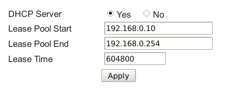
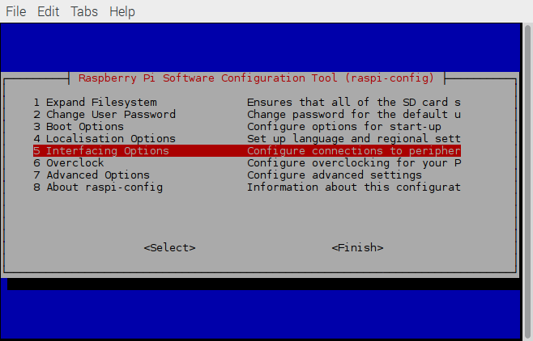
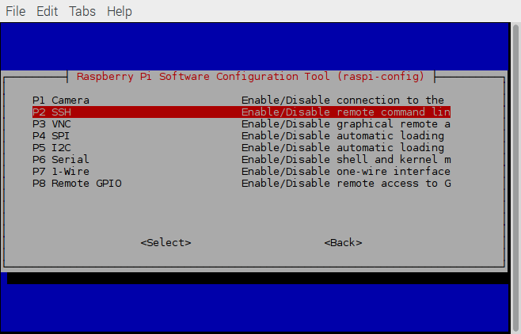

.. title: Connecting a Raspberry Pi to a home Linux network
.. slug: connecting-a-raspberry-pi-to-a-home-linux-network
.. date: 2017-02-05 10:28:17 UTC+01:00
.. tags: raspberry pi, linux
.. category: 
.. link: 
.. description: 
.. type: text

I recently purchased a Raspberry Pi 3 Model B and have been tinkering
with it for a few days. One of the first things I decided to do was to
set it up so that I could access it from my laptop over my home
network. This post contains a step-by-step explanation of the
process. If you have any questions, feel free to leave a comment or
send me an e-mail.

Collect the necessary information
=================================

To start, we need to collect a little bit of information about the
home network. My internet is provided by a local company that supplied
me with a Thomson TWG-870 router. This router determines the IP
addresses of all the devices on my network. Since my laptop is running
Linux (Debian Jessie, to be exact), I can use the :code:`netstat`
command to get the IP address of the router.::

  kmdouglass@kmd-laptop:~$ netstat -rn
  Kernel IP routing table
  Destination     Gateway         Genmask         Flags   MSS Window  irtt Iface
  0.0.0.0         192.168.0.1     0.0.0.0         UG        0 0          0 wlan0

The key part of this output is the :code:`Gateway` column. A gateway
is the IP address of the device (i.e. the router) that provides
devices on a local network with access to the Internet.

Knowing the IP address of the gateway, we can next trying entering it
directly into the address bar of a web browser. On my machine, this
opened a dialog asking for a username and password. (If you're not
sure what these are, try asking your ISP. And if you haven't changed
them from the default settings, then you really should do this.) After
entering them and clicking **OK**, the browser window displayed the
general configuration pages for the router.

The next few steps will depend on the specific router. The information
we are after is the list of IP addresses that the router reserves for
static IP's. A static IP address is an address that is assigned to a
device and doesn't change. Many routers have a so-called DHCP server
that dynamically assigns IP addresses to devices such as smart phones
as they log onto the network. We probably want to always find the Pi
at the same address, however, so a static IP makes more sense than one
that the router dynamically assigns.

To find the list of static IP's on my specific router, I clicked on
the link entitled **Network** in my router's configuration page. The
relevant information for me looks like that in the image below:

This information is telling us that the router is reserving addresses
192.168.0.10 to 192.168.0.254 for the DHCP server. We can therefore
most probably use 192.168.0.2 through 9 for static IP's. (Remember
that 192.168.0.1 is already taken; it's the address of the router.) I
tested 192.168.0.2 by pinging it and received no response, so we will
use this address for my Raspberry Pi. (Use Ctrl-C to stop pinging the
device.)::

  kmdouglass@kmd-laptop:~$ ping 192.168.0.2
  PING 192.168.0.2 (192.168.0.2) 56(84) bytes of data.
  From 192.168.0.15 icmp_seq=1 Destination Host Unreachable
  From 192.168.0.15 icmp_seq=2 Destination Host Unreachable
  From 192.168.0.15 icmp_seq=3 Destination Host Unreachable
  ^C
  --- 192.168.0.2 ping statistics ---
  4 packets transmitted, 0 received, +3 errors, 100% packet loss, time 3014ms
  pipe 3

For the next step, we need to collect the broadcast and subnet mask of
the network. We can do this from the laptop that is already connected
to the network by running the :code:`sudo ifconfig` command. This
command will report information that looks similar to the following
example (note that this is not from my machine but is merely for
illustration):::

  eth0 Link encap:Ethernet HWaddr 00:10:5A:1A:DC:65
  inet addr:198.209.253.169 Bcast:208.141.109.255 Mask:255.255.255.0
  UP BROADCAST RUNNING MULTICAST MTU:1500 Metric:1
  RX packets:18940 errors:1 dropped:0 overruns:0 frame:2
  TX packets:11554 errors:0 dropped:0 overruns:0 carrier:0
  collisions:2 txqueuelen:100
  RX bytes:4087250 (3.8 Mb) TX bytes:2499423 (2.3 Mb)
  Interrupt:11 Base address:0xd000

The very first line tells us that this block of output belongs to the
**eth0** interface. If you connect to the internet on your laptop
through WiFi, then you may need to find the information for the
**wlan0** interface instead. wlan0 is usually used to refer to
wireless interfaces in Ubuntu and Debian Linux.

The first line of output from ifconfig also provides the type of
hardware and the ID of the ethernet card. The information we need,
however, is on the second line. The device's IP address on the network
is **inet addr:198.209.253.169**, but we don't really need this
information. Rather, we need the two numbers that come next. The
broadcast IP is reported in **Bcast:208.141.109.255** and the subnet
mask in **Mask:255.255.255.0**. The `broadcast IP`_ is used to send
messages to all devices on the network, whereas the `subnet mask`_ is
used to separate the parts of an address that identify the network
from the parts that identify the devices and possible "sub-networks."

To summarize this section, we need:

1. The static IP address that we'll assign to the Pi
2. The IP address of the router, i.e. the gateway address
3. The broadcast IP
4. The subnet mask

.. _broadcast IP: https://en.wikipedia.org/wiki/Broadcast_address
.. _subnet mask: https://en.wikipedia.org/wiki/Subnetwork
  
Configure the Pi
================

Now that we have decided on an IP address for the Pi, let's boot it up
and configure it to always use this IP address. (I am currently using
the **NOOBS** operating system that came with my Pi starter kit, but
this should work with other flavors of Debian Linux as well.)

Once logged on to the Pi, open a terminal and make a backup copy of
the file **/etc/network/interfaces**::

  sudo cp /etc/network/interfaces /etc/network/interfaces.bak

Making a backup is good practice; in case we ruin the configuration
file, we can simply rewrite it using our backup. Next, open the
original **interfaces** file for editing. In this example, I'll use
the **nano** editor::

  sudo nano /etc/network/interfaces

In this file, add the following lines (replacing the addresses with
those appropriate for your network)::
    
  auto eth0
  iface eth0 inet static
      address 192.168.0.2
      netmask 255.255.255.0
      gateway 192.168.0.1
      broadcast 192.168.0.255

What do these lines do, you ask? Let's step through them one-by-one.

Start the network interface at boot
+++++++++++++++++++++++++++++++++++

First off, we need to identify the network interface. **eth0** is the
identifier that is referring to the dedicated ethernet port on the
Pi. The line **auto eth0** means that this interface will be started
at boot.

Configure the interface to use a static IP
++++++++++++++++++++++++++++++++++++++++++

Next, we see the line **iface eth0 inet static**. First, **iface
eth0** means that we are configuring the ethernet port interface that
was described in the last section. Following that, **inet** specifies
that the interface uses TCP/IP networking. Finally, **static** is
telling the NOOBS operating system that the device is going to request
a static IP address from the router. (I obtained this explanation from
`this forum post`_.)

.. _this forum post: http://askubuntu.com/questions/411616/what-does-keywords-in-my-etc-network-interfaces-means

Set the various addresses
+++++++++++++++++++++++++

The next lines are indented because they are properties of the **inet
static** family. If you've read everything until now, you should be
able to figure out what addresses to enter next for each option. The
desired static IP address for the Pi should follow the **address**
field; the subnet mask, gateway, and broadcast IP's described above
should follow **netmask**, **gateway**, and **broadcast**
respectively.

The **network** property (which is not shown above) contains the
network address and `is required for 2.0.x kernels`_. These kernels
are pretty old by now, so it is unlikely that you will need to specify
this property.

.. _is required for 2.0.x kernels: http://man.cx/interfaces%285%29

Restart the network interface
+++++++++++++++++++++++++++++

Restarting the interface we just configured on our Pi is as simple
as entering these terminal commands::

  sudo ifdown eth0
  sudo ifup eth0

(Remember to replace eth0 with the appropriate interface if yours is
different.) If everything goes well, we should be able to use our web
browser to navigate on the Internet. We should also be able to ping
the Pi from the laptop and vice versa.

Connecting to the Pi
====================

Once the Pi is on the network, we need a way to connect to it from the
laptop and other devices so that we can actually use it for
something. One way is to use `ssh`_, or Secure SHell. ssh is program
that let's us securely log on to other devices through a shell
(i.e. terminal). This is useful for when we need to work only on the
command line.

If, on the other hand, we want a "Remote Desktop"-like GUI
environment, we can use `VNC`_. The documentation for VNC is quite
good but detailed; I'll let you read up on it on your own if you're
interested in using it.

I'll now briefly explain how we can set up ssh on the Pi.

.. _ssh: https://support.suso.com/supki/SSH_Tutorial_for_Linux
.. _VNC: https://www.raspberrypi.org/documentation/remote-access/vnc/

Enable ssh on the Pi
++++++++++++++++++++

We need to enable ssh access to the Pi before we can use it. On the
Pi, open a terminal and run the configuration utility:::

  sudo raspi-config

We should see the following window appear.

Use the keyboard to highlight **Interface Options** and tap the Enter
key. In the following menu, we now should see an option to enable ssh
as in the following image. Use the keyboard to highlight **P2 SSH**
(or the relevant menu item if the name is different on your Pi) and
hit the Enter key to enable it. Once ssh is enabled, we can hit Esc or
select the <Back> option to until we exit the configuration utility.

If you'e following along, you may need to restart your Pi for these
changes to take effect.

Log onto the Pi from the laptop
+++++++++++++++++++++++++++++++

Now for the moment of truth. After restarting the Pi, **we need to
first ensure that we are not logged in to it**. If we are, simply
click the **Menu** button, followed by **Shutdown... -> Logout** and
log out of the session.

Next, open a terminal on the laptop and enter the following command,
changing the IP address to whatever was decided upon for the Pi:::

  ssh pi@192.168.0.2

This command runs the ssh program and asks to sign into the Pi as the
user called **pi**. After running the command, we may be prompted for
a password to log on if one was set on the Pi. (You did set one,
didn't you?) Once successfully entering the password, we should notice
that the terminal prompt has changed to something like
:code:`pi@raspberrypi:~ $`. This indicates that we are logged on to
the Pi. If we enter the :code:`ls` command, we should see the contents
of the Pi's home directory. When we're ready to disconnect from the
Pi, we can simply use the :code:`exit` command at any time in the
terminal. The prompt should change to reflect that we are back on our
laptop machine when we have successfully exited.

If this is all working as described above, then congratulations on
connecting your Pi to your home Linux network! I wish you many happy
hours of hacking :)

Further Reading
===============

1. The Debian network setup manual is very detailed and describes
   many, many more aspects of setting up a network than I touched upon
   here. https://www.debian.org/doc/manuals/debian-reference/ch05.en.html
2. The Raspberry Pi documentation about VNC (Virtual Network
   Computing) is a great resource for setting up a graphical interface
   to remotely connect to your
   Pi. https://www.raspberrypi.org/documentation/remote-access/vnc/
