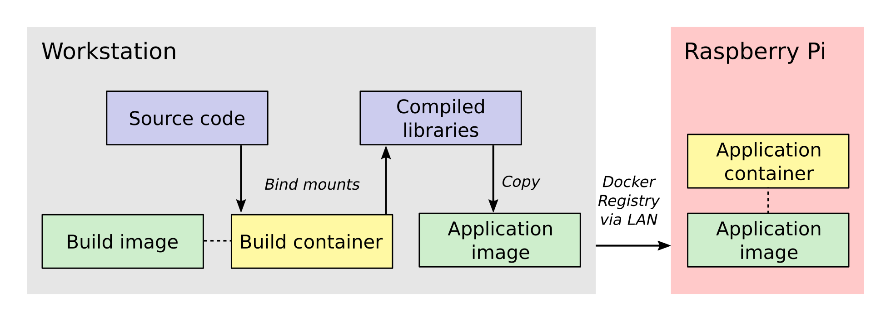

.. title: How I built a cross-compilation workflow for the Raspberry Pi
.. slug: how-i-built-a-cross-compilation-workflow-for-the-raspberry-pi
.. date: 2018-04-29 12:10:26 UTC+02:00
.. tags: raspberry pi, micro-manager, docker
.. category: raspberry pi
.. link: 
.. description: How to setup a cross-compilation workflow with Docker.
.. type: text

Some of you may know I tinker with the Raspberry Pi in my free time
and that one of my current projects is to build a lensless microscope
with the Pi as the brains. To control the microscope, I decided a
while ago that I would use `Micro-Manager
<https://micro-manager.org/wiki/Micro-Manager>`_, an open-source
software package for microscope control. I made this decision for a
few reasons:

1. I already knew the Micro-Manager codebase since I use it frequently
   at work.
2. The Micro-Manager core provides a device-independent interface to
   hardware.
3. I've contributed to the project in the past and feel a sense of
   loyalty to the project and the people involved. Expanding
   Micro-Manager into embedded microscopy would be a great way for me
   to give back to the community.

Building Micro-Manager from source code presents its own set of
challenges. After ensuring that you have the correct build
environment, you need to actually compile it, and here's where things
get tricky in Raspyberry Pi development. The Pi has an ARM processor,
whereas most laptops and workstations use a x86_64 processor. This
means that code compiled on a typical desktop PC will not work on the
Pi. As I showed in `my earlier post
<https://kmdouglass.github.io/posts/micro-manager-on-the-raspberry-pi.html>`_,
you can compile the code directly on the Pi to circumvent this, but
this unfortunately is quite cumbersome because the code base and
dependencies are quite large. (They are nearly 8 GB in
total). Furthermore, compiling the project on the Pi is slow and
requires connecting to it via ssh or working directly on a TV screen
or monitor.

These problems extend beyond Micro-Manager to other large-scale
projects that require code compilation for a specific processor
architecture. In this post, I'll describe the workflow that I
developed for cross-compiling projects for the Raspberry Pi.

Previous attempts
=================

Prior to the workflow that is the main topic of this post, I managed
to cross-compile Micro-Manager using a `chroot` environment and the
`QEMU emulator <https://www.qemu.org/>`_. `chroot
<https://en.wikipedia.org/wiki/Chroot>`_ is a Linux command that
changes the apparent root (or '/') directory for a running
process. With this approach, I mount an image of the `Raspbian
operating system <https://www.raspberrypi.org/downloads/raspbian/>`_
that contains the gcc and g++ compilers and libraries for the ARM
architecture. Then, I chroot into the image and run a setup script
that builds the software. During execution of this script, the QEMU
static libraries run the ARM compilers from within the chroot
environment to build the project. The compiled code remains inside the
image, which I then burn onto a micro SD card to insert into the Pi. I
uploaded `a gist of the bash script
<https://gist.github.com/kmdouglass/38e1383c7e62745f3cf522702c21cb49>`_
which orchestrates all this, and my inspiration for this approach came
from a great series of blog posts from `Disconnected Systems
<https://disconnected.systems/blog/custom-rpi-image-with-github-travis/>`_.

Ultimately this approach is a huge amount of work. As you can see in
the gist, it's fairly complicated bash scripting that's not easy to
debug. Furthermore, the setup script that is run inside the image
needs to do a lot of work beyond cross-compiling, like setting up the
user, permissions, network, etc. Debugging the final product is also a
challenge because you need to verify that it's working on the Pi,
which requires burning the image to a micro SD card.

Cross-compiling with Docker
===========================

After a bit of research I decided I would try instead to use `Docker
<https://www.docker.com/>`_ for cross-compilation and deployment to
the Pi. I had just started using Docker at work to build reproducible
environments for scientific computing research. In particular, and
unlike my chroot script, I had learned that a Docker container that
built the project could work on nearly any system that had Docker
installed. Furthermore, deploying updates can be done on any Raspberry
Pi that's running Docker.

I liked the idea of a portable cross-compilation workflow, so I dove
into the Docker documentation and managed to get everything working in
a few weeks of tinkering at home.

An overview of Docker
---------------------

You can find many resources online about Docker, so I won't go into
the details here. The main thing you need to know is that Docker is a
system for creating, running, and sharing *containers*, which are
something like light weight virtual machines. Containers solve the
problem in software development of how to build and deploy programs
that have a complex set of dependencies. It does this by isolating the
environment in which a program runs from the rest of the operating
system. For example, if you have a computer that has a certain version
of gcc (the GNU C compiler) installed, but your application requires a
different version, then you can install the required gcc along with
your application inside a container and they will not interfere with
the version of gcc that belongs to your operating system. This also
means that you can send your container to any machine that has Docker
installed and it should just run without having to do any setup.

Other important things to know about Docker are:

- There are two main types of objects: images and containers. Images
  are sort of like blueprints that define what is inside a container,
  whereas containers are like the actual buildings specified by the
  blueprints. There can be many containers that come from a single
  image.
- Containers are meant to be immutable. When you stop them and restart
  them, they always restart in the same state as when they were first
  created.
- Since containers are immutable, some of your application data may
  need to be placed in a volume, which is either another container or
  a folder on the host system. A volume gets connected to your
  application container and exists even when your application
  container is not running.

The cross-compilation workflow
==============================

Now that we have established the essential background to this project,
let's look at the cross-compilation workflow. Below is a picture that
provides a sense of the entire process, moving in general from
left-to-right.

The process involves two Docker containers: one for building
Micro-Manager and the other for running the application. The build
dependencies and the QEMU emulator are both located inside the build
container, having been specified when its image was created. These
allow us to compile Micro-Manager for the ARM architecture.  The
source code is connected to the build container as a *bind mount*,
which is a folder from the host workstation that is mounted inside the
build container when it is run.

Once the libraries are compiled, they are installed into a folder
inside the bind mount so that the host system will have access to them
after the build container closes. Next, the compiled libraries are
copied directly into an image that defines the application
container. This image defines only the essential run-time requirements
for running Micro-Manager and nothing else. The application image is
stored on the registry server which I set up on my local network. This
makes it easy for the Raspberry Pi to download the latest image and
run the Micro-Manager application container whenever I make changes.

An important aspect of this workflow is how the data is passed between
the systems and containers. Unlike what you will find in many
introductory tutorials on Docker, I do not add the Micro-Manager
source code directly to the build image/containers but instead use a
bind mount. The reason for this is that the source code and 3rd party
libraries are quite large, about 8 GB in total. By using a bind mount,
I avoid needless copying of this data. Another reason for using a bind
mount is that the source code will change frequently during
development. If I add the source code to the image, then I will have
to recreate the image every time the source code changes.

Once the libraries are built, I directly copy them into the
application image because they are much, much smaller than the source
code. I also want the code stored directly in the image so that the
application image is all the Raspberry Pi needs to run the
program. The image is stored in my local `Docker registry
<https://docs.docker.com/registry/>`_ server so that once I push an
updated image to the server, the Raspberry Pi can download it and use
it immediately.

Step 0: Prerequisites
---------------------

I am going to assume that you already have installed Docker. (If not,
follow `these directions <https://docs.docker.com/install/>`_.) I am
also going to assume that you are somewhat familiar with how to work
on a Linux system. The Raspberry Pi runs Linux, so you probably
wouldn't be here if you didn't already know at least a little.

For this article, I am working with these versions of Docker and
Ubuntu on my host workstation.::

  kmdouglass@xxxxx:~$ uname -a
  Linux xxxxx 4.13.0-39-generic #44~16.04.1-Ubuntu SMP Thu Apr 5 16:43:10 UTC 2018 x86_64 x86_64
  x86_64 GNU/Linux

  kmdouglass@xxxxx:~$ docker version
  Client:
   Version:      18.03.1-ce
   API version:  1.37
   Go version:   go1.9.5
   Git commit:   9ee9f40
   Built:        Thu Apr 26 07:17:20 2018
   OS/Arch:      linux/amd64
   Experimental: false
   Orchestrator: swarm

  Server:
   Engine:
    Version:      18.03.1-ce
    API version:  1.37 (minimum version 1.12)
    Go version:   go1.9.5
    Git commit:   9ee9f40
    Built:        Thu Apr 26 07:15:30 2018
    OS/Arch:      linux/amd64
    Experimental: false

Finally, below is how my project directory structure is laid out.::

  kmdouglass@xxxxx:~/src/alphapi/docker$ tree -L 2
  .
  └── rpi-micromanager
      ├── 2.0-python
      │   ├── build
      │   └── Dockerfile
      └── build
          ├── build
          ├── Dockerfile
          ├── run
          └── setup

I have two folders; build, which contains the files for the build
container, and 2.0-python, which contains the files for creating the
Micro-Manager application container. (In my case, I am going to build
the Python wrapper for Micro-Manager 2.0.) Inside each folder are the
scripts and Dockerfiles that execute the various steps of the
workflow.

The final prerequisite is to register QEMU with the Docker build
agent. First, install a few packages for QEMU. On Ubuntu, this looks
like

.. code-block:: shell

   $ sudo apt update
   $ sudo install qemu qemu-user-static qemu-user binfmt-support

Finally, register the build agent with the command:

.. code-block:: shell

   $ docker run --rm --privileged multiarch/qemu-user-static:register --reset

Step 1: Create the build image
------------------------------

Inside the build folder, I have a file called Dockerfile. Here are its
contents.

.. code-block:: shell

   # Copyright (C) 2018 Kyle M. Douglass
   #
   # Defines a build environment for Micro-Manager on the Raspberry Pi.
   #
   # Usage: docker build \
   #          -t NAME:TAG \
   #	     .
   #

   FROM resin/raspberrypi3-debian:stretch
   MAINTAINER Kyle M. Douglass <kyle.m.douglass@gmail.com>

   RUN [ "cross-build-start" ]

   # Get the build dependencies.
   RUN apt-get update && apt-get -y install --no-install-recommends \
   autoconf \
   automake \
   build-essential \
   git \
   libatlas-base-dev \
   libboost-dev \
   libboost-all-dev \
   libtool \
   patch \
   pkg-config \
   python3-dev \
   python3-pip \
   python3-setuptools \
   python3-wheel \
   swig \
   && apt-get clean && rm -rf /var/lib/apt/lists/* \
   && pip3 install numpy

   RUN [ "cross-build-end" ]

   # Set up the mount point for the source files and setup script.
   ADD setup /micro-manager/
   VOLUME /micro-manager/src

   WORKDIR /micro-manager/src
   ENTRYPOINT [ "/sbin/tini", "-s", "--" ]
   CMD [ "/micro-manager/setup" ]

A Dockerfile defines the steps in building an image -- in this case,
the build image. Let's break this file down into pieces. In the first
two lines that follow the comments, I specify that my image is based
on the resin/raspberrypi3-debian:stretch image and that I am the
maintainer.

.. code-block:: shell

   FROM resin/raspberrypi3-debian:stretch
   MAINTAINER Kyle M. Douglass <kyle.m.douglass@gmail.com>

Images from `Resin <https://hub.docker.com/u/resin/>`_ are freely
available and already have the QEMU emulator installed. Next, I
specify what commands should be run for the ARM architecture. Any
commands located between ``RUN [ "cross-build-start" ]`` and ``RUN [
"cross-build-end" ]`` will be run using the emulator. Inside these two
commands, I install the build dependencies for Micro-Manager using
``apt-get`` and ``pip``. (These are just standard commands for
installing software on Debian/Ubuntu Linux machines and from PyPI,
respectively.)

After the installation of the requirements completes, I add the setup
script to the folder /micro-manager inside the image with the ``ADD
setup /micro-manager/`` command. The setup script contains the
commands that will actually compile Micro-Manager. I then define a
mount point for the source code with ``VOLUME
/micro-manager/src``. **It's important to realize here that you do not
mount volumes inside images, you mount volumes inside containers.**
This command is just telling the image to expect a folder to be
mounted at this location when the container is run.

The last three lines set the working directory, the entrypoint and the
default container command, respectively.

.. code-block:: shell
		
   WORKDIR /micro-manager/src
   ENTRYPOINT [ "/sbin/tini", "-s", "--" ]
   CMD [ "/micro-manager/setup" ]

This specific entrypoint tells Docker that any containers built from
this image should first run Tini, which is a lightweight init system
for Docker containers. If you do not specify Tini as the entry point,
then it will not be able to reap zombies. (I don't know what this
means exactly, but it sounds cool and you can read about it here:
https://github.com/krallin/tini)

By default, the container will run the setup script, but, since I used
the ``CMD`` directive, this can be overriden in case we need to
perform some manual steps. Roughly speaking, you can think of the
entrypoint as the command that can not be overridden and the CMD
command as the one that can be. In other words, Tini will always be
executed when containers created from this image are launched, whereas
you can choose not to run the setup script but instead to enter the
container through a Bash shell, for example.

To build the image, I use the following build script located in the
same directory as the Dockerfile for convenience.

.. code-block:: shell

   #!/bin/bash
   # Copyright (C) 2018 Kyle M. Douglass
   #
   # Usage: ./build
   #

   docker build \
          -t localhost:5000/rpi-micromanager:build \
          .

By using ``-t localhost:5000/rpi-micromanager:build`` argument I am
giving the image a name of *rpi-micromanager*, a tag of *build*, and
specifying that I will eventually host this image on my local registry
server (localhost) on port 5000.

In case you are wondering about the contents of the setup script,
don't worry. I'll explain it in the next section.

Step 2: Compile Micro-Manager
-----------------------------

After the image is built, I create a container and use it to compile
Micro-Manager. For this, I use the run script in the build directory.

.. code-block:: shell

   #!/bin/bash
   # Copyright (C) 2018 Kyle M. Douglass
   #
   # Usage: ./run DIR CONFIGURE
   #
   # DIR is the parent folder containing the micro-manager Git
   # repository, the 3rdpartypublic Subversion repository, and any
   # additional build resources.
   #
   # If CONFIGURE=true, the build system is remade and the configure
   # script is rerun before running 'make' and 'make install'. If
   # CONFIGURE=false, only 'make' and 'make install' are run.
   #
   # The compiled program files are stored in a bind mount volume so that
   # they may be copied into the deployment container.
   #

   src_dir=$1
   cmd="/micro-manager/setup $2"

   # Remove the build artifacts from previous builds.
   if [ "$2" == true ] || [ "$2" == false ]; then
       rm -rf ${src_dir}/build || true
   fi

   docker run --rm \
          -v ${src_dir}:/micro-manager/src \
          --name mm-build \
          localhost:5000/rpi-micromanager:build \
          ${cmd}

The script takes two arguments. The first is the path to the folder
containing all the source code (see below for details). The second
argument is either **true** or **false**. (It can actually be
anything, but it will only compile Micro-Manager if either **true** or
**false** are provided.) If true, the full build process is run,
including setting up the configure script; if false, only make and
make install are run, which should recompile and install only recently
updated files.

The run script uses the -v argument to ``docker run`` to mount the
source directory into the container at the point specified by the
``VOLUME`` command in the Dockerfile. The directory layout on my host
file system for the source directory looks like this::

  kmdouglass@xxxxx:/media/kmdouglass/Data/micro-manager$ tree -L 1
  .
  ├── 3rdpartypublic
  ├── micro-manager
  └── patches

The patches folder is not necessary and only there to fix `a bug
<https://github.com/micro-manager/micro-manager/pull/613>`_ in the
WieneckeSinscke device adapter. (This bug may be fixed by now.)
3rdpartypublic is the large Subversion repository of all the required
software to build Micro-Manager, and micro-manager is the `cloned
GitHub repository
<https://github.com/micro-manager/micro-manager>`_. Prior to building,
I checkout the mm2 branch because I am interested in developing my
application for Micro-Manager 2.0.

The setup script that is run inside the container and mentioned in the
previous section looks like this.

.. code-block:: shell

   #!/bin/bash
   #
   # # Copyright (C) 2018 Kyle M. Douglass
   #
   # Builds Micro-Manager.
   #
   # Usage: ./setup CONFIGURE
   #
   # If CONFIGURE=true, the build system is remade and the configure
   # script is rerun before running 'make' and 'make install'. If
   # CONFIGURE=false, only 'make' and 'make install' or run.
   #
   # Kyle M. Douglass, 2018
   #

   # Move into the source directory.
   cd micro-manager

   # Undo any previous patches.
   git checkout -- DeviceAdapters/WieneckeSinske/CAN29.cpp
   git checkout -- DeviceAdapters/WieneckeSinske/WieneckeSinske.cpp

   # Patch the broken WieneckeSinske device adapter.
   patch DeviceAdapters/WieneckeSinske/CAN29.cpp < ../patches/CAN29.cpp.diff \
   && patch DeviceAdapters/WieneckeSinske/WieneckeSinske.cpp < ../patches/WieneckeSinske.cpp.diff

   # Compile MM2.
   if [ "$1" = true ]; then 
       # Remake the entire build system, then compile from scratch.
       ./autogen.sh
       PYTHON="/usr/bin/python3" ./configure \
           --prefix="/micro-manager/src/build" \
 	   --with-python="/usr/include/python3.5" \
       	   --with-boost-libdir="/usr/lib/arm-linux-gnueabihf" \
	   --with-boost="/usr/include/boost" \
	   --disable-java-app \
	   --disable-install-dependency-jars \
	   --with-java="no"
       make
       make install
       chmod -R a+w /micro-manager/src/build
   elif [ "$1" = false ]; then
       # Only recompile changed source files.
       make
       make install
       chmod -R a+w /micro-manager/src/build
   else
       echo "$1 : Unrecognized argument."
       echo "Pass \"true\" to run the full build process."
       echo "Pass \"false\" to run only \"make\" and \"make install\"."
   fi

Most important in this script is the call to ``configure``. You can
see that the compiled libraries and Python wrapper will be written to
the build folder inside the mounted directory. This gives the host
file system access to the compiled artifacts after the container has
stopped.

Step 3: Build the application image
-----------------------------------

Once the libraries are compiled, we can add them to an application
image that contains only the essentials for running Micro-Manager.

For this, I use a separate Dockerfile inside the 2.0-python
directory.

.. code-block:: shell

   # Copyright (C) 2018 Kyle M. Douglass
   #
   # Builds the Micro-Manager 2.0 Python wrapper for the Raspberry Pi.
   #
   # Usage: docker build \
   #          -t NAME:TAG \
   #	      .
   #

   FROM resin/raspberrypi3-debian:stretch
   MAINTAINER Kyle M. Douglass <kyle.m.douglass@gmail.com>

   RUN [ "cross-build-start" ]

   # Install the run-time dependencies.
   RUN apt-get update && apt-get -y install --no-install-recommends \
       libatlas-base-dev \
       libboost-all-dev \
       python3-pip \
       python3-setuptools \
       python3-wheel \
       && pip3 install numpy \
       && apt-get clean && rm -rf /var/lib/apt/lists/*

   # Copy in the Micro-Manager source files.
   RUN useradd -ms /bin/bash micro-manager
   WORKDIR /home/micro-manager/app
   COPY --chown=micro-manager:micro-manager . .

   RUN [ "cross-build-end" ]

   # Final environment configuration.
   USER micro-manager:micro-manager
   ENV PYTHONPATH /home/micro-manager/app/lib/micro-manager
   ENTRYPOINT ["/sbin/tini", "-s", "--"]
   CMD ["/usr/bin/python3"]

As before, I use a clean resin base image. However, this time I only
install the essential software to run Micro-Manager.

After apt-getting and pip-installing everything, I create a new user
called **micro-manager** and a new folder called **app** inside this
user's home directory.

.. code-block:: shell

   # Copy in the Micro-Manager source files.
   RUN useradd -ms /bin/bash micro-manager
   WORKDIR /home/micro-manager/app

Next, I directly copy the compiled libraries into the image with the
COPY command.

.. code-block:: shell

   COPY --chown=micro-manager:micro-manager . .

The two periods (.) mean that I copy the current host directory's
contents into the container's current working directory
(/home/micro-manager/app). What is the current host directory? Well,
as I explain below, I actually run this Dockerfile from inside the
**build** folder that was created to hold the compiled libraries in
the previous step. But first, I'll end my explanation of the
Dockerfile by saying that I switch the USER so that I do not run the
container as root, add the library to the PYTHONPATH environment
variable, and setup the default command as the python3 interpreter.

To build this image, I use the following build script.

.. code-block:: shell

   #!/bin/bash
   # Copyright (C) 2018 Kyle M. Douglass
   #
   # Usage: ./build DIR
   #
   # DIR is the root directory containing the Micro-Manager build
   # artifacts. These artifacts will be added to the Docker image.
   #

   src_dir=$1

   cp Dockerfile ${src_dir}
   cd ${src_dir}

   docker build \
          -t localhost:5000/rpi-micromanager:2.0-python \
       	  .

This script takes one argument, which is the **build** directory
containing the compiled source code. The script first copies the
Dockerfile into this directory and then changes into it with the cd
command. (This explains the two periods (.) in the COPY command in the
Dockerfile.)

Finally, I build the image and give it a name of
localhost:5000/rpi-micromanager:2.0-python.

Step 4: Add the image to the local registry server
--------------------------------------------------

Now we need a way to get the image from the workstation onto the
Raspberry Pi. Of course, I could manually transfer the file with a USB
stick or possibly use ssh, but what if I have multiple Pi's? This
process could become cumbersome. Docker provides a few ways to push
and pull images across a network. The most obvious is `Dockerhub
<https://hub.docker.com/>`_, a site for freely sharing images. For the
moment I don't want to use Dockerhub, though, because I have not yet
checked all the software licenses and am unsure as to what my rights
are for putting an image with Micro-Manager software on a public
repository.

A better option, especially for testing, is to use a local registry
server. This server operates only on my home network and already
allows my workstation and Pi's to communicate with one
another. Following the `official registry documentation
<https://docs.docker.com/registry/deploying/>`_ and `this blog post by
Zachary Keeton <http://zacharykeeton.com/docker-private-registry/>`_,
I managed to setup the registry as follows.

Host setup
++++++++++

First, we need to setup a transport layer security (TLS)
certificate. It's possible to run the server without one if you don't
expect your network to be attacked, but it's good practice so let's
create one.

To do this, I edit the /etc/ssl/openssl.cnf file and add the following
to the top of the [ v3_ca ] section.::

  subjectAltName = IP:192.168.XXX.XXX

where the IP address is the address of the workstation on the
network. Next, I actually create the certificate. I make a directory
called certs inside my workstation home directory and then use openssl
to make the cerficate. During the prompts, I press ENTER at every step
except the FQDN (fully qualified domain name). For the FQDN, I enter
the same IP address as above.

.. code-block:: shell

   mkdir certs
   openssl req -newkey rsa:4096 -nodes -sha256 \
   -keyout certs/domain.key -x509 -days 365 \
   -config /etc/ssl/openssl.cnf -out certs/domain.crt

**I had to add the ``-config /etc/ssl/openssl.cnf`` argument for the
subject alternative name to be added to the certificate.** This part
was tricky, because if this argument is not included, then the key
generation step will use some other .cnf file (I am not sure
which). This results in the following SAN error when attemptingt to
connect to the registry.::

  cannot validate certificate for 192.168.XXX.XXX because it doesn't contain any IP SANs

After the domain.key and domain.crt files have been created, I run the
official registry server container. (See how handy Docker containers
are? There's no messy installation beyond grabbing the container.)

.. code-block:: shell

   docker run -d -p 5000:5000 \
     --restart=always \
     --name registry \
     -v $(pwd)/certs:/certs \
     -e REGISTRY_HTTP_TLS_CERTIFICATE=/certs/domain.crt \
     -e REGISTRY_HTTP_TLS_KEY=/certs/domain.key \
     registry:2

If the registry:2 image is not already downloaded, then it will be
downloaded for automatically when running the container. Note that
the -p 5000:5000 argument indicates that the server is using port 5000
on both the host system and inside the container. Note also that the
certs directory is relative to the current directory because I use the
($pwd) command. You can change this to an absolute path if you wish on
your setup.

Let's go ahead and push the application image to the server now that
it's running.

.. code-block:: shell

   docker push localhost:5000/rpi-micromanager:2.0-python

Setup the Pi
++++++++++++

Now, startup the Pi. I will assume that you have `already installed
Docker
<https://www.raspberrypi.org/blog/docker-comes-to-raspberry-pi/>`_ on
it and know how to communicate with it via ssh and copy files to it
using scp.

I copy the certificate from the host with scp.

.. code-block:: shell

   sudo mkdir -p /etc/docker/certs.d/192.168.XXX.XXX:5000/
   sudo scp kmdouglass@192.168.XXX.XXX:/home/kmdouglass/certs/domain.crt /etc/docker/certs.d/192.168.XXX.XXX:5000/ca.crt

The IP address that I am using is the one to the machine where the
registry server is running. After this step, I make the operating
system trust the certificate.

.. code-block:: shell

   sudo scp kmdouglass@192.168.XXX.XXX:/home/kmdouglass/certs/domain.crt /usr/local/share/ca-certificates/192.168.XXX.XXX.crt
   sudo update-ca-certifications

Finally, I restart the Docker daemon.

.. code-block:: shell

   sudo service docker restart

If everything is working, then I should be able to pull the image from
your network's registry server.

.. code-block:: shell

   docker pull 192.168.XXX.XXX:5000/rpi-micromanager:python2.0
  
Step 5: Run Micro-Manager!
--------------------------

And now the moment of truth: running the application container. Since
it's setup to run Python automatically, I use a pretty simple ``docker
run`` command.

.. code-block:: shell

   docker run -it --rm \
        --name micro-manager \
        192.168.XXX.XXX:5000/rpi-micromanager:2.0-python

I verify that the Micro-Manager Python wrapper is working by trying to
import it and run `a few basic commands
<https://micro-manager.org/wiki/Using_the_Micro-Manager_python_library>`_.

.. code-block:: python

   >>> import MMCorePy
   >>> mmc = MMCorePy.CMMCore()
   >>> mmc.getVersionInfo()

If these work without error, then congratulations! You're now ready to
start building your embedded microscopy system ;)

Step 6: Running the whole process
---------------------------------

The beauty of having scripted all these steps is that the full
workflow may be executed quite simply. From the host system's build
folder, run::

  kmdouglass@xxxxx:~/src/alphapi/docker/rpi-micromanager/build$ ./build
  kmdouglass@xxxxx:~/src/alphapi/docker/rpi-micromanager/build$ ./run /path/to/source true

From the 2.0-python folder::

  kmdouglass@xxxxx:~/src/alphapi/docker/rpi-micromanager/2.0-python ./build /path/to/source/artifacts
  kmdouglass@xxxxx:~$ docker push localhost:5000/rpi-micromanager:2.0-python

And from the Raspberry Pi::

  pi@yyyyy:~$ docker pull 192.168.XXX.XXX:5000/rpi-micromanager:2.0-python
  pi@yyyyy:~$ docker run -it --rm \
                     --name micro-manager \
                     192.168.XXX.XXX:5000/rpi-micromanager:2.0-python

Hopefully this is enough to get you started building Micro-Manager for
the Raspberry Pi with Docker. Though I focused on Micro-Manager, the
workflow should be generally applicable to any large scale project in
which you want to isolate the build environment from the host machine.

If you have any questions, just leave them in the comments. Happy
programming!
